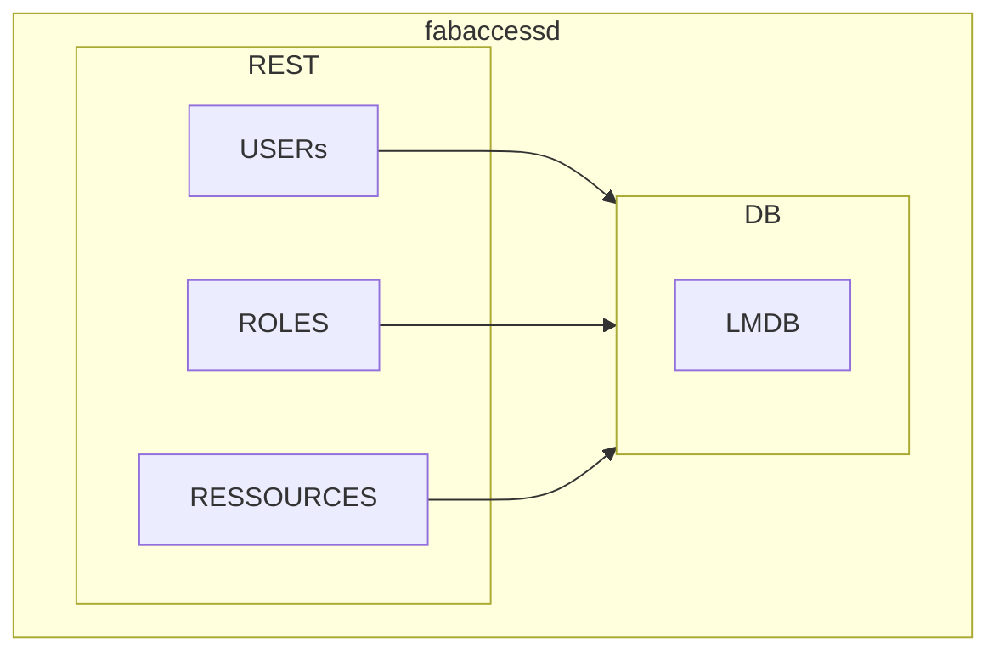

# FabAccess Server

Binary is named **fabaccessd**.

## What is this?

FabAccess is a prototype-grade software suite for managing access, mostly aimed
at Makerspaces, FabLabs, and other open workshops.  It is designed to allow secure access control to
machines and other equipment that is dangerous or expensive to use. It tries to also be cheap enough
to be used for all other things one would like to give exclusive access to even when they are not
dangerous or expensive to use (think 3D printers, smart lightbulbs, meeting rooms).

## Details

## History

### Previous name

Previously a more academic name was used for the server (Difluoroborane, short BFFH). In the effort to get development more straight forward - a more straight forward name was chosen.
